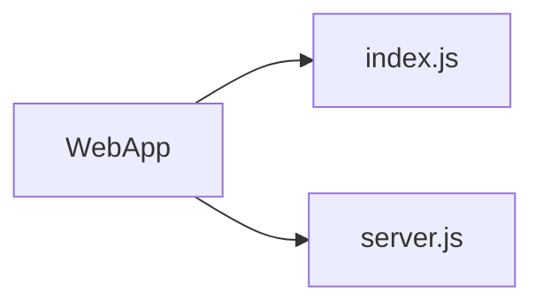

# **NodeJS!**

- Node.js realmente es sólo otro contexto de JavaScript: Permite correr código JavaScript en el backend, fuera del browser.

- Para ejecutar el código JavaScript que tu pretendes correr en el backend, este necesita ser interpretado y, bueno, ejecutado, Esto es lo que Node.js realiza, haciendo uso de la Maquina Virtual V8 de Google, el mismo entorno de ejecución para JavaScript que Google Chrome utiliza.

- Entonces, Node.js es en realidad dos cosas: un entorno de ejecución y una librería.

## **La Pila de Aplicaciones: Aplicacion Web con NodeJS**

- Servidor HTTP
- Enrutador: responder directamente peticiones (requests), dependiendo de qué URL sea pedida en este requerimiento, es que necesitaremos algún tipo de enrutador (router) de manera de mapear los peticiones a los handlers (manejadores) de éstos.
- Handlers: Manejadores de Peticiones

## **NodeJS como Servidor HTTP**

- Bueno, con Node.js, las cosas son un poco distintas. Porque con Node.js, no solo implementamos nuestra aplicación, nosotros también implementamos todo el servidor HTTP completo. De hecho, nuestra aplicación web y su servidor web son básicamente lo mismo.

## **Web App en Modulos .JS**



## **Server.JS**
```javascript
var http = require("http");

http.createServer(function(request, response) {
  response.writeHead(200, {"Content-Type": "text/html"});
  response.write("Hola Mundo");
  response.end();
}).listen(8888);
```
- Ejecutando: node server.js
- Visible en: http://localhost:8888/

## **Paso de Funciones de un Lado a Otro**

```javascript
function decir(palabra) {
  console.log(palabra);
}

function ejecutar(algunaFuncion, valor) {
  algunaFuncion(valor);
}

ejecutar(decir, "Hola");
```


## **CallBacks Manejadas por Eventos**
